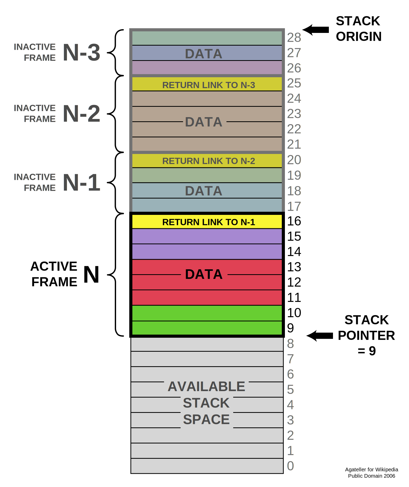
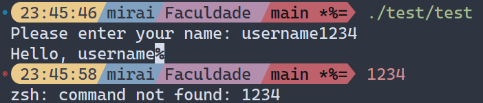

# O que é um Ataque de Buffer Overflow?

Um ataque de *Buffer Overflow* (Transbordamento de *Buffer*) consiste no excesso de entrada de dados intensional para execução de códigos em uma região específica para o armazenamento temporário de dados conhecida como *Buffer*.

Vejamos o seguinte exemplo:

Alocamos 8-bits na memória para a entrada de um nome de usuário, dado que 1 caractere ocupa apenas 1-bit, o maior nome que podemos utilizar deve ter ***apenas*** 8 letras, quando entramos com mais letras que isto temos um *Buffer Overflow* e os dados subsequentes na memória são sobrescritos.


## Como os dados são alocados na memória de um computador

Existem variados métodos de gerenciamento de memória, então irei ater-me ao método usado por sistemas baseados em UNIX (O gerenciamento em pilha (STACK)).

|  |
| :---: |
| *Um exemplo de memória em Stack* |

As *stacks* tem gerenciamento de dados *LIFO (Last-In First-Out)*, onde o primeiro dado a entrar é o ultimo a sair, isso acaba sendo mais eficiente que outras alocações pois permite ao desenvolvedor organizar seus programa de tal forma que dados de longa duração sejam alocados primariamente à *stack* enquanto dados de curta duração encontram-se ao final da mesma para fácil acesso.

Cada *thread* de processo tem sua própria *stack* no qual o valor de tamanho máximo varia de acordo com a *PALAVRA (WORD)* da *CPU*; quando alocamos mais dados que o possível para tal *stack* temos um transbordamento de dados; e como geralmente em linguagens de baixo nível operacional como *assembly* ou C não contém checagens nativas para tais erros, os dados excedentes acabam sendo alocados no setor adjacente, sobrescrevendo quaisquer dados ali encontrados. Isso é perigoso pois pode sobrescrever espaços usados por aplicativos do sistema, gerando comportamento inesperado.

Um exemplo do uso da *stack* com um *buffer* em assembly:

```nasm
; Programa escrito para demonstrar a usabilidade da Stack em linguagem assembly
; E também para servir como ambiente de testagem de um BufferOverflow
;
; Nós vamos usar a chamada de sistema `sys_read` para receber e processar
; a entrada de dados do usuário. Na tabela de chamadas do kernel Linux
; essa função tem o código de operação 3. E recebe 3 argumentos que serão
; carregados nos registradores `EDX`, `ECX`, `EBX`; as utilidades de design
; de cada registrador vão além do escopo desse exemplo.
;
; Os argumentos passados para cada registrador serão os seguintes:
;   - EDX irá carregar o tamanho máximo alocado para o buffer
;   - ECX será carregado com o endereço da nossa variável criada na seção .bss
;   - EBX será carregado com o arquivo que queremos ler, nesse cado StdIn.
;
; Quando `sys_read` detecta um caractere de `linefeed` (ENTER) o controle
; retorna ao programa e aloca as entradas do usuário no endereço passado a ECX.
;
; Retifico que a explicação a cima é refente a leitura de dados através do STdIn
; Os registradores serão amplamente usados  para outras funções 
;
; O intuito desse exemplo além de mostrar a usabilidade da stack
; é também mostrar um exemplo de overflow
; experimente introduzir respostas maiores que 8 caracteres.
;
; Esse exemplo usa o Kernel Linux, para o Kernel DOS se faz necessário
; o uso outros códigos na tabela do Kernel.
;==============================================================================
section .data                                           ; Essa é nossa seção de variáveis inicializadas
msg1        db      'Please enter your name: ', 0h      ; Variável pedindo pelo input do usuário
msg2        db      'Hello, ', 0h                       ; Variável usada para cumprimentar o usuário
 
section .bss                                            ; Essa é nossa seção de variáveis não inicializadas
sinput:     resb    8                                   ; Reserva um espaço de 8 bytes na memória para entrada de dados. (BUFFER)
 
section .text               ; Essa é nossa seção de código
global  _start              ; Declara o ponto de início do nosso programa
 
_start:
 
    mov     eax, msg1       ; move nosso prompt de pergunta para EAX
    call    sprint          ; chama nossa função de print
 
    mov     edx, 8          ; numero de bytes para ler
    mov     ecx, sinput     ; nosso buffer
    mov     ebx, 0          ; lê entrada do StdIn
    mov     eax, 3          ; chama SYS_READ
    int     80h             ; chama o kernel para performar a operação
 
    mov     eax, msg2       ; move nossa mensagem de apresentação para EAX
    call    sprint          ; chama nossa função de print
 
    mov     eax, sinput     ; move nosso buffer para EAX (a string contém um linefeed)
    call    sprint          ; chama nossa função de print
 
    call    quit            ; chama nossa função de saida

;==============================================================================
; int slen(Texto Mensagem)
; Calcula o tamanho de uma Mensagem

slen:
    push    ebx             ; Empurra quaisquer valor guardado em EBX para a STACK
    mov     ebx, eax        ; move o endereço em EBX para EAX, ambos agora apontam para o mesmo seguimento na memória.
 
nextchar:
    cmp     byte [eax], 0   ; Compara o byte apontado por EAX nesse endereço com Zero (Zero é o delimitador de final de string)
    jz      finished        ; Salta (Se a FLAG zero foi ativada) para o ponto no código nomeado 'finished'
    inc     eax             ; Incrementa o endereço em EAX por 1 caso a FLAG zero não tenha sido ativada
    jmp     nextchar        ; Salta para o ponto no código nomeado 'nextchar'
 
finished:
    sub     eax, ebx        ; Subtrai o endereço em EBX pelo endereço em EAX
                            ;   lembre-se ambos os registradores começaram apontando para o mesmo endereço (veja a linha XX)
                            ;   porém nós incrementamos EAX por 1 byte em para cada caractere em nossa string (mensagem/texto)
                            ;   Quando você subtrai um endereço na memória por outro de mesmo tipo o resultado é o numero
                            ;   de segmentos entre eles, nesse caso, o numero de bytes da nossa mensagem.
                            ;   Agora EAX guarda o numero de bytes da nossa mensagem.
    pop     ebx             ; Restauramos EBX para o valor anterior a chamada  da função
    ret                     ; Retornamos de nossa função
 
 
;==============================================================================
; void sprint(Texto Mensagem)
; Exibe uma mensagem sem embutir o caractere LineFeed

sprint:
    push    edx         ; Inserimos EDX na Stack para preservar o valor atual enquanto usamos o registrador na função
    push    ecx         ; Inserimos ECX na Stack para preservar o valor atual enquanto usamos o registrador na função
    push    ebx         ; Inserimos EBX na Stack para preservar o valor atual enquanto usamos o registrador na função
    push    eax         ; Inserimos EAX na Stack para preservar o valor atual enquanto usamos o registrador na função
    call    slen        ; Chamamos SLen para calcular o numero de bytes da string
 
    mov     edx, eax    ; move o numero de bytes calculados por SLen para EDX
    pop     eax         ; retorna nossa mensagem da STACK
 
    mov     ecx, eax    ; move nossa mensagem para ECX
    mov     ebx, 1      ; indica o arquivo de saida para StdOut
    mov     eax, 4      ; chama o código de operação do kernel (SYS_WRITE)
    int     80h         ; chama o kernel para performar a operação
 
    pop     ebx         ; Restaura EBX para o estado anterior a função
    pop     ecx         ; Restaura ECX para o estado anterior a função
    pop     edx         ; Restaura EDX para o estado anterior a função
    ret                 ; Retorna da função
 
 
;==============================================================================
; void sprintLF(Texto Mensagem)
; Exibe uma mensagem com embutindo caractere de LineFeed

sprintLF:
    call    sprint      ; Chamamos SPrint
 
    push    eax         ; Inserimos EAX na Stack para preservar o valor atual enquanto usamos o registrador na função
    mov     eax, 0Ah    ; Movemos a representação HEX do caractere ascii de linha (LineFeed)
    push    eax         ; Inserimos EAX na Stack para pegarmos o endereço
    mov     eax, esp    ; Fazemos o ponteiro atual da stack apontar para EAX para usarmos o SPrint    
    call    sprint      ; Chamamos SPrint
    pop     eax         ; Remove o LineFeed da Stack
    pop     eax         ; Restaura o valor de EAX antes de chamarmos a função
    ret                 ; Retorna para o programa              
 
 
;==============================================================================
; void exit()
; Sai do programa e restaura recursos.

quit:
    mov     ebx, 0      ; Indica o código de saida 0 - "Sem erros"
    mov     eax, 1      ; Indica o código de operação do kernel SYS_EXIT
    int     80h         ; Chama o kernel para performar a operação
    ret                 ; retorna de nossa função (sub-rotina)
```

A função `quit` é uma das funções mais importantes de um programa, para evitar **ERRO_DE_SEGMENTAÇÃO**.

Como vimos nossa STACK é divida em seções (chamadas seguimentos), quando executamos um programa guardado na memória nós devemos especificar onde o programa começa e onde ele termina.

Seu ponto de início pode ser indicado através do rótulo `_start` mas e seu ponto final?

Sem uma forma de indicar ONDE um programa termina o kernel ficará executando os próximos seguimentos até encontrar um comando de parada, e isto é EXTREMAMENTE PERIGOSO, pois não sabemos quais os conteúdos destes próximos segmentos, o kernel em uma tentativa de executar o próximo endereço acaba travando e terminando a execução, nos dando a mensagem `"Erro de segmentação"` (`Segmentation fault`), por isso chamamos a função de saida ao final de nosso programa,  para dizer ao kernel quando parar a execução.

Um ataque de BufferOverflow consiste em forçar esse comportamento transbordando dados maliciosos para os endereços adjacentes para que o kernel os execute.

Agora, voltando ao nosso código, caso você tenha colocado mais que 8 caracteres na entrada, você perceberá um comportamento inesperado, no meu caso ocorreu o seguinte:



O overflow de caracteres acabou indo parar nos endereços de entrada do terminal e sendo executados, agora, veja bem, irei exemplificar a periculosidade disso.

Os sistemas UNIX são muito utilizados para servidores, devido a sua leveza e performance, além do controle. Porém nesses sitemas existe um comando chamado `rm` que é a abreviação de remover; e o disco principal (o local onde o sistema é instalado) fica no caminho `/` (chamado de root).

Agora, imagine que ao invés de ter digitado `username1234` eu tivesse digitado `usernamerm /`?

a palavra `username` seria exibida normalmente, enquanto o código `rm /` teria sido executado pelo terminal e eu estaria sem disco nesse exato momento.

> Apenas para informar o próprio comando `rm` tem verificações que protegem contar isso, mas basta usar essa técnica para executar uma escalação de privilégio e "Adios Sistema".

Os ataques de BufferOverflow são umas das causas por trás de Ataque de DoS (Denial of Service) e DDoS (Distributed Denial of Service) que consistem em sobrecarregar um serviço ou conexão até que ele esteja inoperante, para isso se é feito um overflow de operações a fim de desestabilizar o sistema.

### Como impedir um Ataque de Buffer Overflow?

Basta fazer validação de entrada e assegurar o tamanho exato de dados, por exemplo, no código em NASM eu poderia contar a quantidade caracteres da entrada e subtrair o excedente para garantir o tamanho predeterminado antes que o programa termine e o kernel execute quaisquer outro código.

## Referências Bibliográficas

- <https://www.welivesecurity.com/br/2014/11/11/o-que-e-e-como-funciona-o-buffer-overflow/>
- <https://www.gestortecnico.net/2018/10/o-que-e-ataque-de-buffer-overflow.html>
- <https://owasp.org/www-community/vulnerabilities/Buffer_Overflow>
- <https://owasp.org/www-community/attacks/Buffer_overflow_attack>
- <https://www.fortinet.com/resources/cyberglossary/buffer-overflow>
- <https://en.wikipedia.org/wiki/Buffer_overflow>
- <https://en.wikipedia.org/wiki/Data_buffer>
- <https://comparitech.com/blog/information-security/buffer-overflow-attacks-vulnerabilities/>
<!-- - <https://pt.wikipedia.org/wiki/Transbordamento_de_dados> -->