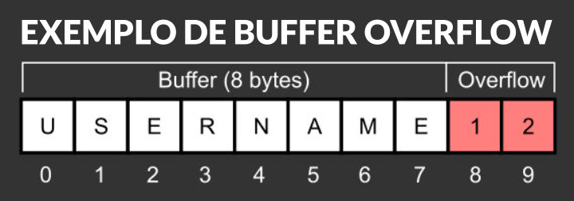

# O que é um Ataque de Buffer Overflow?

Um ataque de *Buffer Overflow* (Transbordamento de *Buffer*) consiste no excesso de entrada de dados intensional para execução de códigos em uma região específica para o armazenamento temporário de dados conhecida como *Buffer*.

Vejamos o seguinte exemplo:

Alocamos 8-bits na memória para a entrada de um nome de usuário, dado que 1 caractere ocupa apenas 1-bit, o maior nome que podemos utilizar deve ter ***apenas*** 8 letras, quando entramos com mais letras que isto temos um *Buffer Overflow* e os dados subsequentes na memória são sobrescritos.



## Como os dados são alocados na memória de um computador

Existem variados métodos de gerenciamento de memória, então irei ater-me ao método usado por sistemas baseados em UNIX (O gerenciamento em pilha (STACK)).

|  |
| :---: |
| *Um exemplo de memória em Stack* |

As *stacks* tem gerenciamento de dados *LIFO (Last-In First-Out)*, onde o primeiro dado a entrar é o ultimo a sair, isso acaba sendo mais eficiente que outras alocações pois permite ao desenvolvedor organizar seus programa de tal forma que dados de longa duração sejam alocados primariamente à *stack* enquanto dados de curta duração encontram-se ao final da mesma para fácil acesso.

Cada *thread* de processo tem sua própria *stack* no qual o valor de tamanho máximo varia de acordo com a *PALAVRA (WORD)* da *CPU*; quando alocamos mais dados que o possível para tal *stack* temos um transbordamento de dados; e como geralmente em linguagens de baixo nível operacional como *assembly* ou C não contém checagens nativas para tais erros, os dados excedentes acabam sendo alocados no setor adjacente, sobrescrevendo quaisquer dados ali encontrados. Isso é perigoso pois pode sobrescrever espaços usados por aplicativos do sistema, gerando comportamento inesperado.

Um exemplo do uso da *stack* em assembly:

```nasm
; Programa escrito para demonstrar a usabilidade da Stack em linguagem assembly
; Nós vamos usar a chamada de sistema `sys_read` para receber e processar
; a entrada de dados do usuário. Na tabela de chamadas do kernel Linux
; essa função tem o código de operação 3. E recebe 3 argumentos que serão
; carregados nos registradores `EDX`, `ECX`, `EBX`, as utilidades de design
; de cada processador vão além do escopo desse exemplo.
;
; Os argumentos passados para cada registrador serão os seguintes:
;   - EDX irá carregar o tamanho máximo alocado para o buffer
;   - ECX será carregado com o endereço da nossa variável criada na seção .bss
;   - EBX será carregado com o arquivo que queremos ler, nesse cado StdIn.
;
; Quando `sys_read` detecta um caractere de `linefeed` (ENTER) o controle
; retorna ao programa e aloca as entradas do usuário no endereço passado a ECX.


section .data
msg1    db  'Por favor insira seu nome: ', 0h   ;
msg2    db  'Olá, ', 0h                         ;

section .bss
usrinput    resb    8                           ;

section .text
global  _start

_start:
    mov     eax, msg1
    call    strprint

    mov     edx, 8
    mov     ecx, usrinput
    mov     ebx, 0
    mov     eax, 3
    int     80h

    mov     eax, msg2
    call    strprint

    mov     eax, usrinput
    call    strprint

    
    call    quit

; Abaixo você encontrará funções auxiliares

strlen:
    push    ebx
    mov     ebx, eax

nextchar:
    cmp     byte [eax], 0
    jz      finished
    inc     eax
    jmp     nextchar

finished:
    sub     eax, ebx
    pop     ebx
    ret

strprint:
    push    edx
    push    ecx
    push    ebx
    push    eax
    call    strlen

    mov     edx, eax
    pop     eax

    mov     ecx, eax
    mov     ebx, 1
    mov     eax, 4
    int     80h

    pop     ebx
    pop     ecx
    pop     edx

quit:
    mov     ebx, 0      ; Status de saida 0 - 'Sem erros durante a execução'
    mov     eax, 1      ; Chama SYS_EXIT (Código de operação no kernel 1)
    int     80h         ; Chama o kernel para performa a execução
    ret

```

A função `quit` é uma das funções mais importantes de um programa, para evitar **ERRO_DE_SEGMENTAÇÃO**.

Como vimos nossa STACK é divida em seções (chamadas seguimentos), quando executamos um programa guardado na memória nós devemos especificar onde o programa começa e onde ele termina.

Seu ponto de início pode ser indicado através do rótulo `_start` mas e seu ponto final?

Sem uma forma de indicar ONDE um programa termina o kernel ficará executando os próximos seguimentos até encontrar um comando de parada, e isto é EXTREMAMENTE PERIGOSO, pois não sabemos quais os conteúdos destes próximos segmentos, o kernel em uma tentativa de executar o próximo endereço acaba travando e terminando a execução, nos dando a mensagem `"Erro de segmentação"` (`Segmentation fault`), por isso chamamos a função de saida ao final de nosso programa,  para dizer ao kernel quando parar a execução.

Você

## Referências Bibliográficas

- <https://www.welivesecurity.com/br/2014/11/11/o-que-e-e-como-funciona-o-buffer-overflow/>
- <https://www.gestortecnico.net/2018/10/o-que-e-ataque-de-buffer-overflow.html>
- <https://owasp.org/www-community/vulnerabilities/Buffer_Overflow>
- <https://owasp.org/www-community/attacks/Buffer_overflow_attack>
- <https://www.fortinet.com/resources/cyberglossary/buffer-overflow>
- <https://en.wikipedia.org/wiki/Buffer_overflow>
- <https://en.wikipedia.org/wiki/Data_buffer>
- <https://comparitech.com/blog/information-security/buffer-overflow-attacks-vulnerabilities/>
<!-- - <https://pt.wikipedia.org/wiki/Transbordamento_de_dados> -->